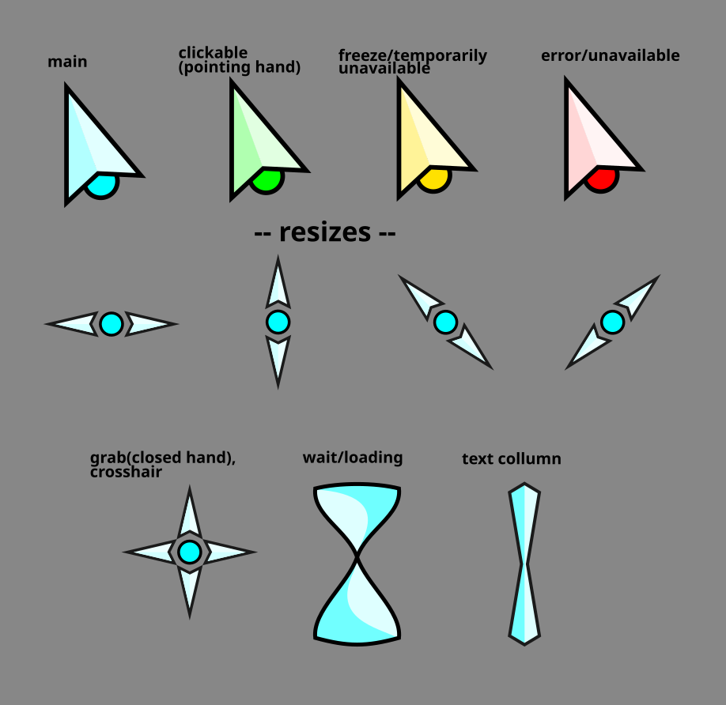

# License
This project is licensed under the [Creative Commons Attribution 4.0 International License](https://creativecommons.org/licenses/by/4.0/legalcode.txt)

You are free to:

    Share — copy and redistribute the material in any medium or format for any purpose, even commercially.
    Adapt — remix, transform, and build upon the material for any purpose, even commercially.
    The licensor cannot revoke these freedoms as long as you follow the license terms.

Under the following terms:

    Attribution — You must give appropriate credit, provide a link to the license, and indicate if changes were made. You may do so in any reasonable manner, but not in any way that suggests the licensor endorses you or your use.
    No additional restrictions — You may not apply legal terms or technological measures that legally restrict others from doing anything the license permits.

Notices:

You do not have to comply with the license for elements of the material in the public domain or where your use is permitted by an applicable exception or limitation.

No warranties are given. The license may not give you all of the permissions necessary for your intended use. For example, other rights such as publicity, privacy, or moral rights may limit how you use the material. 


# Description

Cursor I made for myself, Takes heavy inspiration [Joël K./Future Cyan Hyprcursor]([https://github.com/yeyushengfan258/Future-cursors?tab=readme-ov-file](https://gitlab.com/Pummelfisch/future-cyan-hyprcursor)) which I think is awsome and recommend checking out.

It's very minimal for now and overrides most requests with the main cursor.
I plan to make this a complete set of cursors over time, Requests and suggestions are very welcome. 
I also intend on making an xcursor package soon.

Also attached are the svg's used for the convenience of anyone looking to modify them or move them around.

# Requirements
Required are [Hyprland](https://hypr.land/) and [Hyprcursor](https://github.com/hyprwm/hyprcursor)

# Installation
- Download the folder "FinalCursor-theme" and place it inside 
  ```
  ~/.local/share/icons/
  ```
  - In order to test before adding envars run 
  ```
  hyprctl setcursor FinalCursor-theme 32
  ```
- Add the following environmental variables to your hyprland config:
    - Lua syntax: 
    ```
      hl.env("HYPRCURSOR_THEME", "FinalCursor-theme")
      hl.env("HYPRCURSOR_SIZE", "32")
    ```
    - Hyprlang: 
    ```
      env = HYPRCURSOR_THEME, FinalCursor-theme
      env = HYPRCURSOR_SIZE, 32
    ```
      
- Apply by restarting hyprland or manually for this session by running the aforementioned setcursor command 
